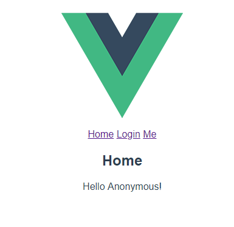

## Spring boot + Vue.js auth sample  

this is demo project for spring boot + vue.js with maven multi module.

- backend : spring boot with OAuth2 server
- frontend : vuejs with access_token  

> #### Project structure  

```
app@app:~/springboot-vuejs-auth$ tree ./ -L 2
./
├── backend         -> Server code
│   ├── pom.xml
│   ├── src
├── frontend        -> Vue.js code
│   ├── src
│   ├── pom.xml     
├── lombok.config
├── pom.xml         -> Maven parent pom
```


> #### Getting access token from API(backend) by using POST MAN  

```aidl
http://localhost:3000/api/oauth/token

Authorization
- type : Basic Auth
- Username : myApp
- Password : pass

Body
x-www-form-urlencoded
username : user@email.com
password : user
grant_type : password
```  

> #### Api

<table>
  <tr>
    <td>Request</td>
    <td>Response</td>
  </tr>
  <tr>
    <td>/api/home (with no token)</td>
    <td>Hello Anonymous!</td>
  </tr>
  <tr>
    <td>/api/home (with token)</td>
    <td>Hello {email}!</td>
  </tr>    
  <tr>
    <td>/api/me (with no token)</td>
    <td>401 error</td>
  </tr>
  <tr>
    <td>/api/me (with token)</td>
    <td>
      {"email" : "user@email.com", "roles" : ["USER"]}    
    </td>
  </tr>       
</table>

> #### Getting started

```aidl
$ git clone https://github.com/zacscoding/springboot-vuejs-auth.git
$ cd springboot-vuejs-auth
$ mvn clean install
$ java -jar backend/target/backend-1.0-SNAPSHOT.jar
OR
$ mvn --projects backend spring-boot:run
```  

> #### webpack-dev-server  

```aidl
$ cd frontend
$ npm start
```  

> #### Demos  

- home (with no sign in)  

  

- home (with sign in)  

  

- me (with sign in)

  

- me (with no sign in)  

=> then redirect to "/login?returnPath=me"


## References  

- maven : https://github.com/jonashackt/spring-boot-vuejs
- vue code : https://github.com/jeonghwan-kim/vue-auth-sample
